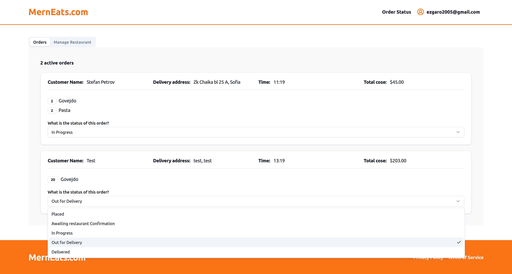

# MERN Food Ordering Application

A full-stack food ordering application built using the **MERN stack**. This project allows users to manage restaurants, browse menus, place orders, and track order statuses in real-time.

---

## Features

### Authentication

- Secure login and logout using **Auth0**.
- Users must be authenticated to access core features like creating restaurants and placing orders.

### Restaurant Management

- **Create your own restaurant** with details like:
  - Name, city, country, cuisines, delivery price, and more.
- Upload images for your restaurant and menu items.
- View and manage orders placed by customers.

### Ordering System

- **Menu browsing** with filtering, sorting, and pagination.
- Add items to the cart and proceed to checkout (powered by **Stripe**).
- Real-time order status updates for both users and restaurant owners:
  - Statuses: `Placed`, `Paid`, `In Progress`, `Out for Delivery`, `Delivered`.

### Search Functionality

- Search for restaurants by name or filter by cuisine and location.
- Pagination and sorting for better navigation.

### Payment Integration

- Secure payments via **Stripe**.
- Checkout process with session management and webhooks for order updates.

---

## Tech Stack

### Frontend

- **React** with **Vite** for fast development.
- **Tailwind CSS** for a mobile-first responsive design.
- **React Query** for efficient data fetching and real-time updates.
- UI components from **shadcn/ui** and **Radix UI**.

### Backend

- **Node.js** with **Express.js** for server-side operations.
- **MongoDB** and **Mongoose** for database management.
- **Stripe** integration for payment processing.
- **Auth0** for secure authentication and authorization.

---

## Folder Structure

## Folder Structure

### Frontend

- `src/components`: Custom reusable UI components.
- `src/pages`: All pages (e.g., Home, Profile, Restaurant).
- `src/api`: Functions for API communication using **React Query**.
- `src/forms`: Form components built with **React Hook Form** and **Zod**.
- `src/auth`: Authentication-related components and hooks.
- `src/config`: Configuration files and environment settings.
- `src/layouts`: Layout components for structuring pages.
- `src/lib`: Utility functions and libraries.

### Backend

- `src/controllers`: Logic for handling API requests.
- `src/routes`: API routes for restaurants, users, and orders.
- `src/models`: MongoDB models for restaurants, users, and orders.
- `src/middleware`: Middleware functions for request processing.

---

## Setup Instructions

### Prerequisites

- **Node.js v20.11.1** or higher.
- MongoDB database.
- Auth0 and Stripe accounts for authentication and payments.

### Installation

1. Clone the repository:

   ```bash
   git clone https://github.com/ezgaro/mern-food-ordering-application.git
   ```

2. Install dependencies:

### Frontend

```bash
cd frontend
npm install
```

### Backend

```bash
cd backend
npm install
```

3. Configure environment variables:

### Frontend .env

VITE_AUTH0_DOMAIN=<Auth0_Domain>
VITE_AUTH0_CLIENT_ID=<Auth0_Client_ID>
VITE_BACKEND_URL=<Backend_URL>

### Backend .env

PORT=7000
MONGO_URI=<MongoDB_URI>
STRIPE_API_KEY=<Stripe_Secret_Key>
FRONTEND_URL=<Frontend_URL>
AUTH0_DOMAIN=<Auth0_Domain>
AUTH0_AUDIENCE=<Auth0_Audience>

4. Start the application:

### Backend

```bash
cd backend
npm run dev
```

### Frontend

```bash
    cd frontend
    npm run dev
```

---

## Screenshots

### Homepage


### Login Page


### Manage Restaurant




### Order Status


### Search Page


### Stripe Checkout Page


## Deployment

The application is deployed separately:

- **Frontend**: Hosted on Render
- **Backend**: Hosted on Render

---

## Future Enhancements

- Improved admin dashboard for restaurant owners.
- Push notifications for order updates.
- Mobile app for enhanced user experience.

---

## License

This project is licensed under the [MIT License](./LICENSE).
